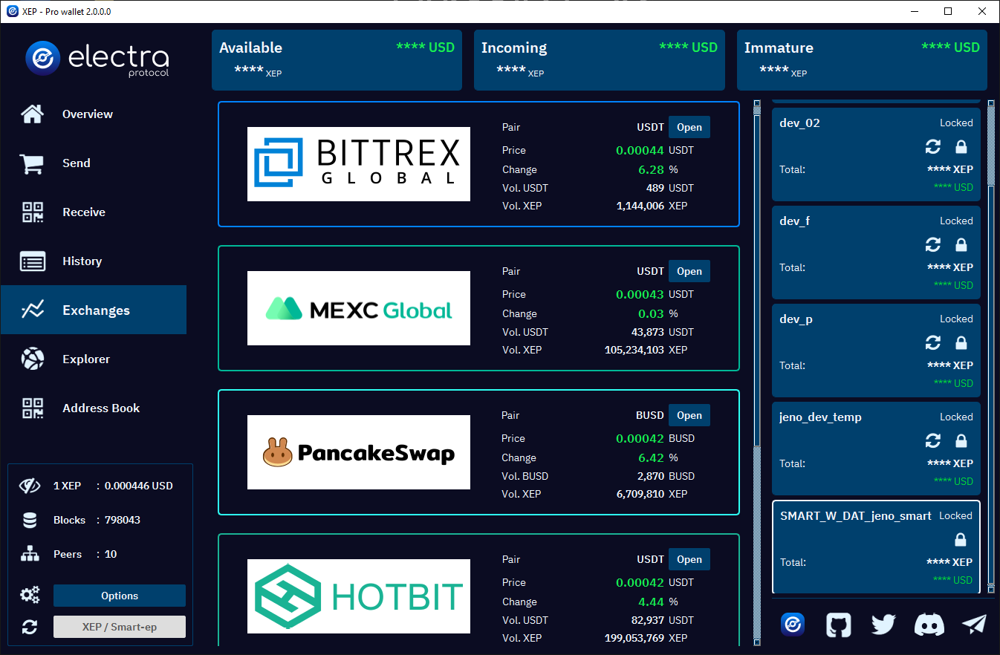
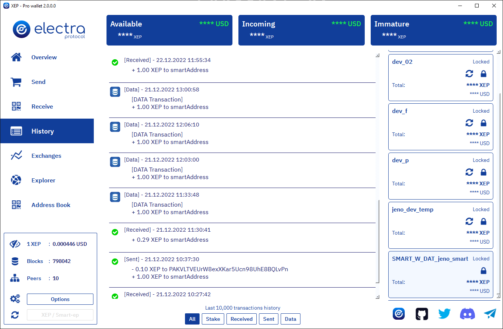
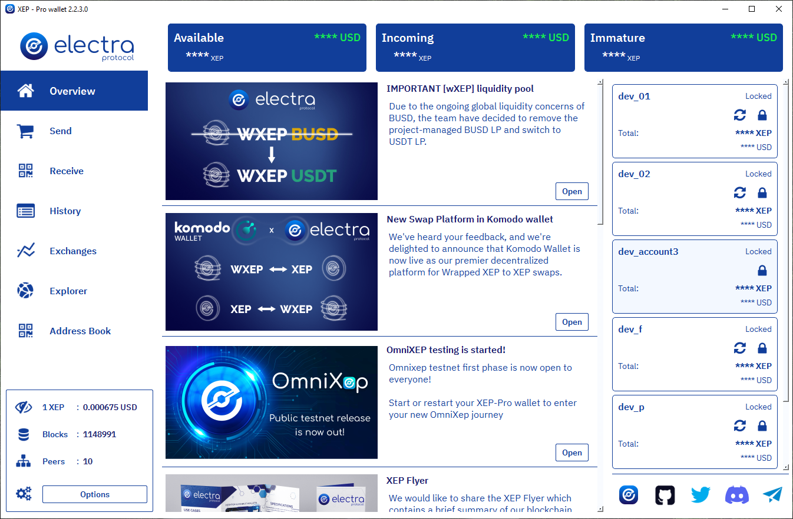

# XEP-Pro

XEP-Pro wallet is a client of Electra Protocol blockchain built in C++ with [Qt](https://www.qt.io) and running the latest [XEP-Core daemon](https://github.com/ElectraProtocol/XEP-Core/releases/tag/v1.0.4.0).

<!-- DOWNLOAD -->

   
  <h3 align="center">Download now - v2.1.0.0</h3>
  <h3 align="center">OmniXep interface included!</h3>
  
  
  
   

<!-- WALLET PREVIEW -->

   
  

   
  
  

   
  
  

### Features

- Multi-wallets management, monitor the events of all your wallets in real time.
- Wallet quotation in 48 fiat currencies
- Exchanges view
- Blockchain explorer
- Automatic update
- Light/Dark theme
- Dedicated address book management
- Built-in backup and import wallet
